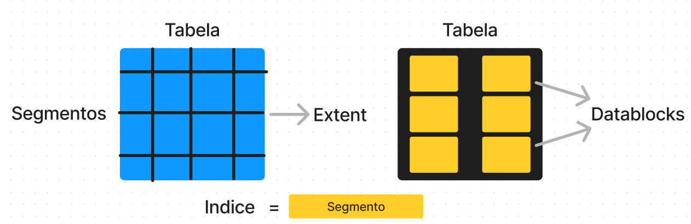

# Oracle DataBase Logic Structures 

### Segmentos: Segmentos são OBJETOS do banco de dados Oracle (Tabelas, Indices, Views, Procedures, etc)

## Datablocks = Unidade de armazenamento de dados no Oracle Database

## Extents = Conjunto de Datablocks (8 a 128 datablocks) -> Extents são alocados automaticamente pelo Oracle Database

### UNIDADES LÓGICAS = Tabelas, Indices, Views, Procedures -> UNIDADES FISICAS = HD, SSD, ARMAZENAMENTOS

### Tabelas -> Segmentos de Dados -> Extents -> Datablocks

